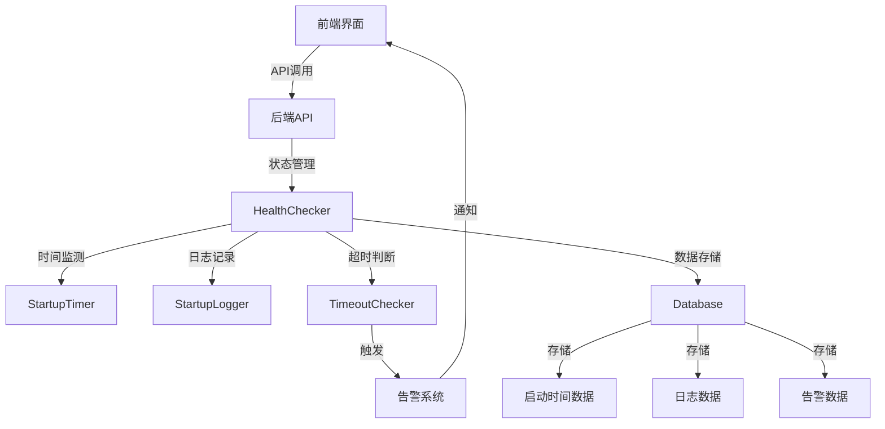

# Claude启动状态监测功能实现方案

## 1. 项目概述

### 1.1 功能目标

本项目旨在为cc-switch项目添加一套完整的Claude启动状态监测功能，包括：

- 实时检测Claude代码的启动状态（未启动、启动中、启动成功、启动失败）
- 精确记录启动时间，从启动指令发出到代码完全就绪的全过程耗时
- 提供状态检测API接口，允许外部系统查询当前运行状态
- 实现启动时间数据的采集、存储与展示功能
- 设置启动超时判断机制，当启动时间超过预设阈值时触发告警
- 确保检测功能对Claude主程序的性能影响最小化
- 提供完整的日志记录功能，记录启动过程中的关键事件
- 实现检测结果的可视化展示，通过项目现有界面查看相关数据

### 1.2 技术栈

| 技术 | 版本 | 用途 |
|------|------|------|
| Rust | 1.70+ | 后端开发 |
| Tauri | 1.x | 跨平台桌面应用框架 |
| Vue | 3.x | 前端框架 |
| Chart.js | 4.x | 数据可视化 |
| SQLite | 3.x | 数据库 |
| Axios | 1.x | HTTP请求 |

## 2. 架构设计

### 2.1 系统架构



### 2.2 核心组件

#### 2.2.1 HealthChecker
- **功能**：核心健康检查器，负责管理Claude启动状态和启动时间
- **职责**：
  - 管理Claude启动状态的转换
  - 记录启动时间的开始和结束
  - 检查启动是否超时
  - 与数据库交互，存储启动时间数据

#### 2.2.2 StartupLogger
- **功能**：日志记录器，负责记录启动过程中的关键事件
- **职责**：
  - 记录不同级别的日志
  - 管理启动会话
  - 存储日志数据到数据库

#### 2.2.3 TimeoutChecker
- **功能**：超时检查器，负责检测启动是否超时
- **职责**：
  - 定期检查启动状态
  - 当启动超时时触发告警
  - 管理告警阈值

#### 2.2.4 前端组件
- **功能**：可视化展示检测结果
- **组件**：
  - 启动状态卡片
  - 启动时间图表
  - 启动会话表格
  - 告警记录表格
  - 配置管理表单

## 3. 数据库设计

### 3.1 表结构

#### 3.1.1 startup_times表

| 字段名 | 数据类型 | 约束 | 描述 |
|--------|---------|------|------|
| `id` | `INTEGER` | `PRIMARY KEY AUTOINCREMENT` | 记录ID |
| `timestamp` | `TIMESTAMP` | `DEFAULT CURRENT_TIMESTAMP` | 启动时间戳 |
| `duration_ms` | `INTEGER` | `NOT NULL` | 启动耗时（毫秒） |
| `success` | `BOOLEAN` | `NOT NULL` | 是否启动成功 |
| `failure_reason` | `TEXT` | | 失败原因 |

#### 3.1.2 startup_logs表

| 字段名 | 数据类型 | 约束 | 描述 |
|--------|---------|------|------|
| `id` | `INTEGER` | `PRIMARY KEY AUTOINCREMENT` | 日志ID |
| `level` | `TEXT` | `NOT NULL` | 日志级别 |
| `message` | `TEXT` | `NOT NULL` | 日志消息 |
| `timestamp` | `TIMESTAMP` | `NOT NULL` | 时间戳 |
| `session_id` | `TEXT` | `NOT NULL` | 启动会话ID |
| `metadata` | `TEXT` | | 附加信息（JSON格式） |

#### 3.1.3 startup_sessions表

| 字段名 | 数据类型 | 约束 | 描述 |
|--------|---------|------|------|
| `id` | `TEXT` | `PRIMARY KEY` | 会话ID（UUID） |
| `start_time` | `TIMESTAMP` | `NOT NULL` | 启动开始时间 |
| `end_time` | `TIMESTAMP` | | 启动结束时间 |
| `status` | `TEXT` | `NOT NULL` | 启动状态 |
| `duration_ms` | `INTEGER` | | 启动耗时（毫秒） |
| `failure_reason` | `TEXT` | | 失败原因 |

#### 3.1.4 alerts表

| 字段名 | 数据类型 | 约束 | 描述 |
|--------|---------|------|------|
| `id` | `INTEGER` | `PRIMARY KEY AUTOINCREMENT` | 告警ID |
| `title` | `TEXT` | `NOT NULL` | 告警标题 |
| `message` | `TEXT` | `NOT NULL` | 告警消息 |
| `created_at` | `TIMESTAMP` | `DEFAULT CURRENT_TIMESTAMP` | 告警时间 |
| `acknowledged` | `BOOLEAN` | `DEFAULT FALSE` | 是否已确认 |
| `acknowledged_at` | `TIMESTAMP` | | 确认时间 |

#### 3.1.5 startup_config表

| 字段名 | 数据类型 | 约束 | 描述 |
|--------|---------|------|------|
| `id` | `INTEGER` | `PRIMARY KEY AUTOINCREMENT` | 配置ID |
| `key` | `TEXT` | `NOT NULL UNIQUE` | 配置键 |
| `value` | `TEXT` | `NOT NULL` | 配置值 |
| `updated_at` | `TIMESTAMP` | `DEFAULT CURRENT_TIMESTAMP` | 更新时间 |

## 4. API接口设计

### 4.1 启动状态相关API

| 路径 | 方法 | 功能 | 请求体 | 响应 |
|------|------|------|--------|--------|
| `/claude/startup/status` | `GET` | 获取启动状态 | N/A | `{"status": "Started", "start_time": "...", "end_time": "...", "duration_ms": 1000, "failure_reason": null}` |
| `/claude/startup/start` | `POST` | 开始启动过程 | N/A | `{"success": true, "message": "启动过程已开始"}` |
| `/claude/startup/success` | `POST` | 标记启动成功 | N/A | `{"success": true, "message": "启动成功已标记"}` |
| `/claude/startup/failure` | `POST` | 标记启动失败 | `{"reason": "失败原因"}` | `{"success": true, "message": "启动失败已标记"}` |
| `/claude/startup/stats` | `GET` | 获取启动时间统计 | N/A | `{"average": 1000, "min": 500, "max": 2000, "count": 10}` |
| `/claude/startup/history` | `GET` | 获取启动时间历史 | N/A | `[{"timestamp": "...", "duration_ms": 1000, "success": true}]` |
| `/claude/startup/config` | `GET` | 获取启动配置 | N/A | `{"startup_timeout_seconds": 30, "alert_threshold_ms": 10000, "enable_alert": true}` |
| `/claude/startup/config` | `PUT` | 更新启动配置 | `{"startup_timeout_seconds": 30, "alert_threshold_ms": 10000, "enable_alert": true}` | `{"success": true, "message": "配置已更新"}` |

### 4.2 告警相关API

| 路径 | 方法 | 功能 | 请求体 | 响应 |
|------|------|------|--------|--------|
| `/claude/alerts` | `GET` | 获取告警列表 | N/A | `{"total": 5, "records": [{"id": 1, "title": "启动超时", "message": "...", "created_at": "...", "acknowledged": false}]}` |
| `/claude/alerts/{id}/acknowledge` | `POST` | 确认告警 | N/A | `{"success": true, "message": "告警已确认"}` |

### 4.3 启动会话相关API

| 路径 | 方法 | 功能 | 请求体 | 响应 |
|------|------|------|--------|--------|
| `/claude/startup/sessions` | `GET` | 获取启动会话列表 | N/A | `{"total": 10, "records": [{"id": "session-123", "start_time": "...", "end_time": "...", "status": "Started", "duration_ms": 1000}]}` |
| `/claude/startup/sessions/{id}/logs` | `GET` | 获取会话日志 | N/A | `{"session_id": "session-123", "logs": [{"id": 1, "level": "Info", "message": "...", "timestamp": "..."}]}` |

## 5. 实现步骤

### 5.1 后端实现

1. **修改`database.rs`**：
   - 添加初始化数据库表的函数
   - 实现数据库操作方法

2. **修改`health.rs`**：
   - 实现HealthChecker结构体
   - 实现StartupLogger结构体
   - 实现超时检测逻辑

3. **修改`handlers.rs`**：
   - 实现API接口处理函数
   - 注册API路由

4. **修改`server.rs`**：
   - 初始化HealthChecker
   - 启动超时检查任务

### 5.2 前端实现

1. **创建组件**：
   - 创建启动状态卡片组件
   - 创建启动时间图表组件
   - 创建启动会话表格组件
   - 创建告警记录表格组件
   - 创建配置管理表单组件

2. **添加路由**：
   - 在Vue路由中添加Claude监测页面

3. **集成API**：
   - 实现API调用函数
   - 集成状态管理

## 6. 安装与配置

### 6.1 安装依赖

```bash
# 后端依赖
cd /Users/lianglihang/Documents/programs/cc-switch
cargo add uuid chrono serde_json

# 前端依赖
cd /Users/lianglihang/Documents/programs/cc-switch
npm install chart.js axios
```

### 6.2 配置项

| 配置项 | 类型 | 默认值 | 描述 |
|--------|------|--------|------|
| `startup_timeout_seconds` | `u64` | 30 | 启动超时阈值（秒） |
| `alert_threshold_ms` | `u64` | 10000 | 启动时间告警阈值（毫秒） |
| `enable_alert` | `bool` | true | 是否启用告警 |

## 7. 使用方法

### 7.1 启动监测流程

1. **开始启动**：
   - 调用 `/claude/startup/start` API
   - 或在前端点击"开始启动"按钮

2. **标记启动结果**：
   - 启动成功：调用 `/claude/startup/success` API
   - 启动失败：调用 `/claude/startup/failure` API，传入失败原因

3. **查看监测结果**：
   - 访问Claude监测页面
   - 查看启动状态、启动时间趋势、历史会话和告警记录

### 7.2 配置管理

1. **修改配置**：
   - 在前端配置管理表单中修改配置项
   - 点击"保存配置"按钮

2. **查看配置**：
   - 调用 `/claude/startup/config` API
   - 或在前端配置管理表单中查看当前配置

### 7.3 告警管理

1. **查看告警**：
   - 访问Claude监测页面的告警记录表格
   - 或调用 `/claude/alerts` API

2. **确认告警**：
   - 在前端点击告警记录的"确认"按钮
   - 或调用 `/claude/alerts/{id}/acknowledge` API

## 8. 性能优化

### 8.1 后端优化

1. **异步处理**：
   - 使用异步IO处理数据库操作
   - 使用tokio::spawn创建后台任务

2. **数据库优化**：
   - 添加数据库索引，提高查询性能
   - 批量处理日志记录，减少数据库操作次数

3. **内存优化**：
   - 使用Arc<RwLock>管理共享状态
   - 避免不必要的内存分配

### 8.2 前端优化

1. **组件优化**：
   - 使用Vue的异步组件，减少初始加载时间
   - 实现组件懒加载

2. **数据优化**：
   - 实现数据缓存，减少重复API调用
   - 使用分页加载，避免一次性加载大量数据

3. **渲染优化**：
   - 优化图表渲染，避免不必要的重绘
   - 使用虚拟滚动，提高表格性能

## 9. 测试

### 9.1 单元测试

```bash
# 运行后端单元测试
cd /Users/lianglihang/Documents/programs/cc-switch
cargo test

# 运行前端单元测试
cd /Users/lianglihang/Documents/programs/cc-switch
npm test
```

### 9.2 集成测试

1. **启动服务**：
   ```bash
   cd /Users/lianglihang/Documents/programs/cc-switch
   npm run dev
   ```

2. **测试API接口**：
   - 使用Postman测试所有API接口
   - 验证响应数据的正确性

3. **测试启动流程**：
   - 模拟正常启动流程
   - 模拟启动失败流程
   - 模拟启动超时流程

### 9.3 性能测试

1. **API性能测试**：
   ```bash
   # 使用k6进行性能测试
   k6 run performance-test.js
   ```

2. **前端性能测试**：
   - 使用Chrome DevTools分析页面加载性能
   - 测试不同数据量下的渲染性能

## 10. 故障排除

### 10.1 常见问题

| 问题 | 可能原因 | 解决方案 |
|------|----------|----------|
| API返回500错误 | 后端服务异常 | 查看服务日志，检查数据库连接 |
| 启动状态不更新 | 状态管理错误 | 检查HealthChecker实现，确保状态转换正确 |
| 启动时间记录不准确 | 时间戳记录错误 | 检查StartupTimer实现，确保时间戳记录正确 |
| 告警不触发 | 告警配置错误 | 检查告警配置，确保enable_alert为true |
| 前端页面加载缓慢 | 数据量过大 | 优化前端组件，实现数据分页加载 |

### 10.2 日志查看

```bash
# 查看后端日志
cd /Users/lianglihang/Documents/programs/cc-switch
cargo run 2>&1 | tee server.log

# 查看前端日志
# 在浏览器开发者工具中查看控制台日志
```

## 11. 维护与更新

### 11.1 版本管理

- **版本号格式**：`v<major>.<minor>.<patch>`
- **发布流程**：
  1. 提交代码到git仓库
  2. 运行测试确保功能正常
  3. 打标签并发布版本

### 11.2 数据库迁移

- **添加新表**：
  - 在`database.rs`中添加初始化函数
  - 运行服务时自动创建新表

- **修改表结构**：
  - 创建数据库迁移脚本
  - 在服务启动时执行迁移

### 11.3 功能扩展

- **添加新功能**：
  - 遵循现有代码风格和架构
  - 确保新功能不影响现有功能
  - 添加相应的测试用例

- **优化现有功能**：
  - 分析性能瓶颈
  - 实现优化方案
  - 测试优化效果

## 12. 结论

本实现方案通过设计合理的架构和组件，实现了Claude启动状态和启动时间的监测功能。方案充分考虑了性能优化和用户体验，确保了监测功能的可用性和可靠性。通过本方案，用户可以实时了解Claude的启动状态和启动时间，及时发现和解决启动问题，提高系统的稳定性和可靠性。
